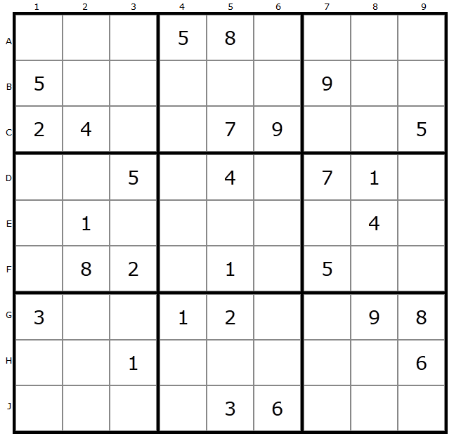

Sudoku Solver in C#
-------------------

Another breakable toy, my variation of Sudoku solver. I've created it without previously googling the topic , and I was quite surprised when latter I realized that most solutions out there use just dumb trial and error. I was also glad that I can re-invent backtracking algorithm ;) 
 
Ok. let's start, from having a Sudoku that we want to solve:

After a little consideration I decided to solve it by elimination of possible values. Let’s consider first block (by block I mean inner 3x3 cells squares), possible values for empty cells:

<table border=1>
  <tbody>
    <!-- Results table headers -->
    <tr>
      <th>Cell \ Value</th>
      <th>1</th>
      <th>3</th>
      <th>6</th>
      <th>7</th>
      <th>8</th>
      <th>9</th>
    </tr>
    <tr>
      <td>A1</td>
      <td>x</td>
      <td></td>
      <td>x</td>
      <td>x</td>
      <td></td>
      <td>x</td>
    </tr>
    <tr>
      <td>A2</td>
      <td></td>
      <td>x</td>
      <td>x</td>
      <td>x</td>
      <td></td>
      <td>x</td>
    </tr>
    <tr>
      <td>A3</td>
      <td></td>
      <td>x</td>
      <td>x</td>
      <td>x</td>
      <td></td>
      <td>x</td>
    </tr>
    <tr>
      <td>B2</td>
      <td></td>
      <td>x</td>
      <td>x</td>
      <td>x</td>
      <td></td>
      <td></td>
    </tr>
    <tr>
      <td>B3</td>
      <td></td>
      <td>x</td>
      <td>x</td>
      <td>x</td>
      <td>x</td>
      <td></td>
    </tr>
    <tr>
      <td>C3</td>
      <td></td>
      <td>x</td>
      <td>x</td>
      <td></td>
      <td>x</td>
      <td></td>
    </tr>
  </tbody>
</table>

We can see that value 1 can be only in A1 cell so fill it in. Check remaining cells and no single value in a row or column. So we evaluate next block:

<table border=1>
  <tbody>
    <!-- Results table headers -->
    <tr>
      <th>Cell \ Value</th>
      <th>1</th>
      <th>2</th>
      <th>3</th>
      <th>4</th>
      <th>6</th>
    </tr>
    <tr>
      <td>A5</td>
      <td></td>
      <td>x</td>
      <td>x</td>
      <td>x</td>
      <td></td>
    </tr>
    <tr>
      <td>B3</td>
      <td></td>
      <td>x</td>
      <td>x</td>
      <td>x</td>
      <td>x</td>
    </tr>
    <tr>
      <td>B4</td>
      <td></td>
      <td></td>
      <td></td>
      <td></td>
      <td>x</td>
    </tr>
    <tr>
      <td>B5</td>
      <td>x</td>
      <td>x</td>
      <td>x</td>
      <td>x</td>
      <td></td>
    </tr>
    <tr>
      <td>C3</td>
      <td></td>
      <td></td>
      <td>x</td>
      <td></td>
      <td>x</td>
    </tr>
  </tbody>
</table>

Now value 1 and 6 are only possible in cells B5 and B4 so we fill them in. Check remaining cells after reduction  - no single possible values – we go to the next block. 
 
We cycle through all blocks until all cells are filled in (will happen only for very simple Sudoku) or number of empty cells is not changed after a cycle. In the second case, we filled what we could using simple elimination and it’s time for more advanced solving techniques or guessing. This time I choose guessing, maybe later I'll implement something more original. So we take first empty cell pick its first possible value fill it in and use recursion and [backtrack algorithm] [1] to check if we can complete the puzzle. If not go back pick next possible value and try again.

That's it the whole working solution can be found on [github] [2]. To test the solution I've used online solver at [Sudoku Wiki] [3]. Beside of detail description of different techniques of solving Sudoku, it allows to import and export puzzle as string of numbers which is really helpful. 
Next step for me is to implement the same algorithm using less familiar languages. I think of Python, Ruby, JavaScript and Dart, F# and maybe Haskell.

[1]: http://en.wikipedia.org/wiki/Backtracking
[2]: https://github.com/sakowiczm/Sudoku-Solver-CSharp
[3]: http://www.sudokuwiki.org/sudoku.htm